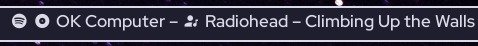

# polybar-currently-playing

This polybar module shows details regarding the currently playing MPRIS item. This script attempts to detect the player or if from the browser, the website, and display an appropriate icon. It is configurable to allow you to shorten long song and album names to a specified length in the `options.cfg` file.

This is a fork of [0jdxt's polybar-mpris](https://github.com/0jdxt/polybar-mpris). I removed the text scrolling and made it truncate instead. If you want a scrolling status bar, check out polybar-mpris!!

The truncation function was inspired by the python script [Jvanrhijn/polybar-spotify](https://github.com/Jvanrhijn/polybar-spotify); I used it as reference when creating the analogous functions in `get_status.sh`.

## Screenshots

This is what it looks like when it's not cutting off the end of the words.



This is what it looks like without the album and artist icons (the rest of the screenshots will be the same).


This is what a shortened song title looks like.


This is what a shortened album name looks like (note that closed parentheses/brackets are added back in).


This is the same thing with a song title.


## Dependencies

- [playerctl](https://github.com/altdesktop/playerctl#installing) - To interface with Spotify and other MPRIS supporting players

## Setup

Note: this script can rate limit spotifyd so the script updates every 10s. To change this or to remove the limit, change or remove the `wait_time=10` option in `scroll_status.sh`

Be sure to set `enable-ipc` to `true` in your bar and enable the module like so (or feel free to put this module wherever you like!):

```dosini
[bar/BAR_NAME]
enable-ipc = true
modules-center = currently-playing
```

Set up the module in your polybar `config.ini`. To set which polybar bar has the module, change `BAR_NAME` to the appropriate name. This module requires a [nerd font](https://www.nerdfonts.com/) by default, otherwise change the icons below and in `display_status.sh` to use emoji or [font awesome](https://fontawesome.com/) icons.

You can add click-left, click-right, and click-middle events for `playerctl` commands to play/pause, skip, etc.

```dosini
[module/currently-playing]
type = custom/script
tail = true
exec = ~/path_to_script/display_status.sh BAR_NAME
```

## Final Notes

- You should be able to add icons for other websites in your browser (or other players) by editing the `get_status.sh` and `display_status.sh` scripts.

- Because of how the window name works in Firefox, it probably won't display icons for websites if you use it.

- If the script doesn't work, make sure it's being run with bash (`/bin/bash -c ~/path_to_script/display_status.sh`)

- Finally, there are some issues with multiple audio devices playing at the same time; the script tends to show one of them while the other is playing, even if the one showing is paused.
