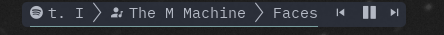
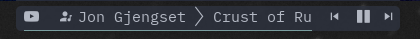
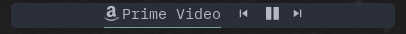

# polybar-mpris

This polybar module shows details regarding the currently playing MPRIS item. This script attempts to detect the player or if from the browser, the website, and display an appropriate icon. The top two would be scrolling whereas the last wouldn't.







## Dependencies

- [playerctl](https://github.com/altdesktop/playerctl#installing) - To interface with Spotify and other MPRIS supporting players
- [zscroll](https://github.com/noctuid/zscroll#installation) - To scroll the fetched text

## Setup

Note: this script can rate limit spotifyd so I have the script update every 10s. To change this or to remove the limit, change or remove the `-U 10` option in `scroll_status.sh`

Be sure to set `enable-ipc` to `true` in your bar ane enable the modules like so:

```dosini
[bar/BAR_NAME]
enable-ipc = true
modules-center = mpris mpris-prev mpris-play-pause mpris-next
```

Set up the modules in your polybar `config`. To set which polybar bar has the module, change `BAR_NAME` to the appropriate name. This module requires a [nerd font](https://www.nerdfonts.com/) by default, otherwise change the icons below and in `scroll_status.sh` to use emoji or [font awesome](https://fontawesome.com/) icons.

```dosini
[module/mpris]
type = custom/script
tail = true
exec = ~/repos/polybar-mpris/scroll_status.sh BAR_NAME

[module/mpris-prev]
type = custom/script
exec = echo "玲"
click-left = playerctl previous

[module/mpris-play-pause]
type = custom/ipc
hook-0 = echo ""
hook-1 = echo ""
initial = 1
click-left = playerctl play-pause

[module/mpris-next]
type = custom/script
exec = echo "怜"
click-left = playerctl next
```

